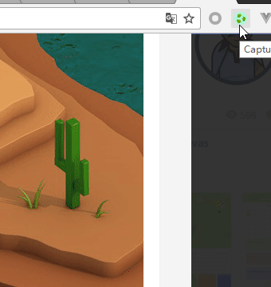
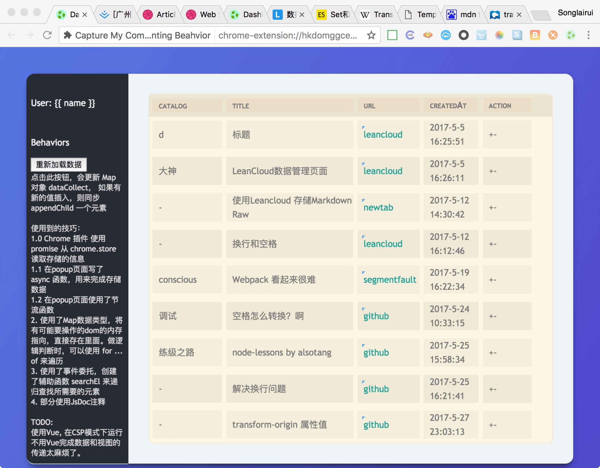
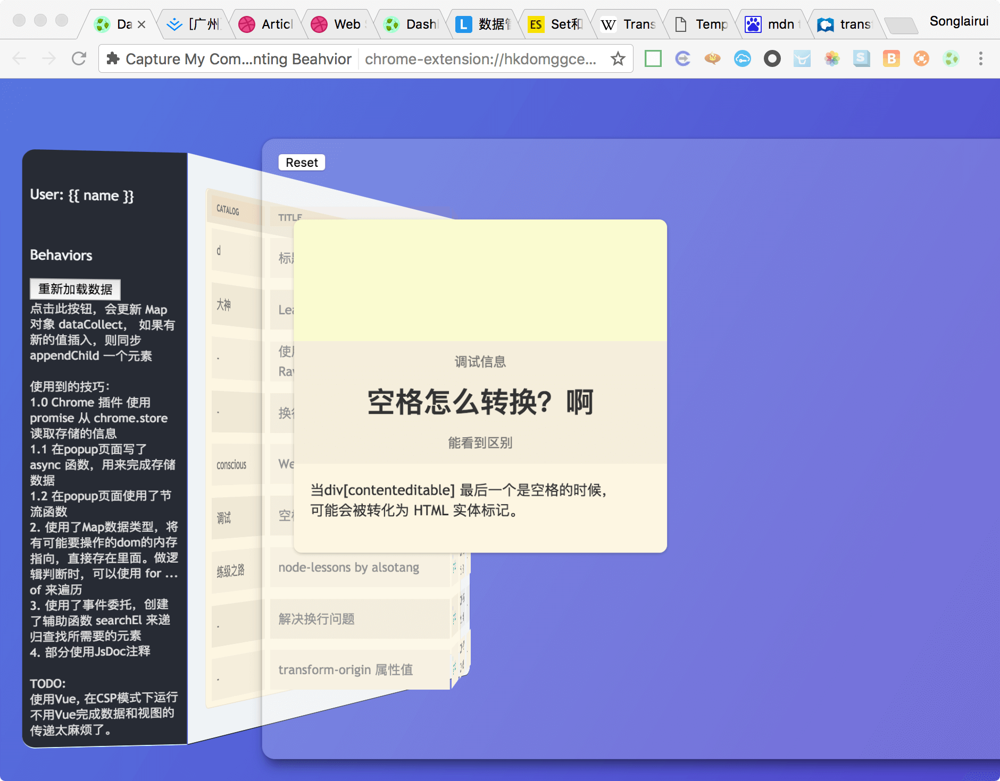

[未完成]

# 起点
  在掘金上提交自己对文章的评论时，我想到此个推荐的文章，我已经阅读完毕了。此时进行留言，是对自己思考过的东西尝试整理。这个过程应该是个有用的过程。
  在未来，我可能需要总结自己的能力，或者在脑海之中演绎一些idea的时候，需要一定的经历来支撑。
  如果我回想起来在这里的思考，我需要的这个支撑就能得到满足。在这里的评论，就是一个启发我回想起来自己思考过程的钥匙🔑。
  
  所以，当前idea成型，我要将自己的网络活动都统筹起来。
  一个浏览器拓展插件，看起来能够完成我想要做的事情。  
  事实上，我体验过roboForm密码记录工具，我知道在桌面环境端，是能够捕捉自己的录入行为的。这是我认为自己这个idea可行的依据。

## 使用方法

Chrome Extension 加载未打包的扩展 ，选择src文件夹

## Preview

插件打开，和内容输入    
  
Dashboard 列表  
 

Dashboard 卡片信息  
 
  3D transform, 以及有意思的自动生成特定HTML的Js处理逻辑。

## 使用的技巧  

1. Chrome 插件 使用 promise 从 chrome.store 读取存储的信息
1. 在popup页面写了 async 函数，用来完成存储数据
1. 在popup页面使用了节流函数
2. 使用了Map数据类型，将有可能要操作的dom的内存指向，直接存在里面。做逻辑判断时，可以使用 for ... of 来遍历
3. 使用了事件委托，创建了辅助函数 searchEl 来递归查找所需要的元素
4. 部分使用JsDoc注释

# TODO

- [ ] Dashboard 页面
 - [x] 初始显示功能
- [x] 页面记住未提交数据
  - [ ] 录入区域清空
- [ ] 约定catalog
- [ ] popup 页面
 - [ ] 提示信息显示优化
  - [ ] 加入心跳效果。使用了节流函数，debug的信息能看出来节流效果。信息内容不适合稳定版本显示，但节流效果可以显示。
- [ ] dashboard 页面
 - [x] 列表显示
 - [x] 界面交互设计
  - [ ] 响应式尺寸关系
 - [ ] 数据分页
 - [ ] 数据增 改

# 额外的说明  
Js 的判断单元，写的非常之多。如果能画出来个流程图，可能会很花很好看。  
